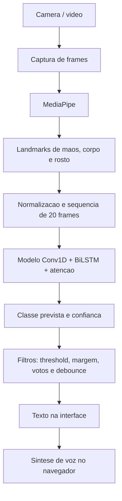

# Relatorio Final - Tradutor de Libras para Audio com IA

## Identificacao

**Disciplina:** Inteligencia Artificial  
**Tipo de trabalho:** Projeto pratico com desenvolvimento de prototipo  
**Tema:** Tradutor de Libras para texto e audio usando visao computacional e aprendizado de maquina  
**Projeto:** Tradutor de Libras com IA

## 1. Objetivo principal

O objetivo deste projeto e desenvolver um prototipo funcional de um sistema baseado em Inteligencia Artificial capaz de reconhecer sinais de Libras a partir da camera de um computador e converter o resultado em texto e audio. A proposta busca criar uma ponte de comunicacao entre pessoas que utilizam Libras e pessoas que nao dominam a lingua, reduzindo barreiras em situacoes cotidianas de atendimento, conversa e interacao presencial.

O prototipo implementado reconhece sinais isolados em tempo real. O sistema captura imagens da webcam, extrai pontos de referencia do corpo, das maos e do rosto, organiza esses dados como uma sequencia temporal, classifica o sinal por meio de uma rede neural treinada e apresenta o resultado na interface web. Quando um sinal e aceito, o texto correspondente tambem pode ser falado automaticamente por sintese de voz no navegador.

## 2. Descricao do problema e relevancia

A comunicacao entre pessoas surdas que utilizam Libras e pessoas ouvintes que nao conhecem a lingua ainda depende, em muitos contextos, da presenca de interpretes ou de alternativas improvisadas de comunicacao. Isso pode dificultar atividades simples, como explicar uma necessidade, pedir ajuda, realizar um atendimento ou participar de uma conversa rapida.

O uso de computadores e smartphones com camera torna possivel propor solucoes de apoio mais acessiveis. A ideia central do projeto e usar a camera como sensor, transformar o movimento do usuario em dados numericos e aplicar um modelo de IA para reconhecer os sinais. Assim, mesmo que o prototipo tenha vocabulario limitado, ele demonstra a viabilidade de um pipeline completo de reconhecimento: captura de video, extracao de caracteristicas, classificacao, exibicao textual e sintese de voz.

## 3. Escopo do prototipo

O sistema desenvolvido contempla as funcionalidades essenciais previstas no enunciado:

| Funcionalidade | Implementacao no projeto |
| --- | --- |
| Captura de video | Interface web acessa a webcam pelo navegador usando `getUserMedia`. |
| Rastreamento corporal | Backend usa MediaPipe para extrair landmarks de maos, pose corporal e pontos selecionados do rosto. |
| Classificacao dos sinais | Modelo TensorFlow/Keras classifica sequencias de 20 frames em uma das classes treinadas. |
| Geracao de texto | Interface mostra o sinal reconhecido, confianca, historico e top predicoes. |
| Sintese de voz | Frontend usa Web Speech API (`speechSynthesis`) para falar o sinal reconhecido em portugues do Brasil. |
| Feedback humano | Interface permite registrar acertos ou corrigir predicoes, salvando novas amostras rotuladas. |

O vocabulario atual do modelo possui 11 classes:

| Classe | Papel no sistema |
| --- | --- |
| Aceitar | Sinal reconhecido |
| Banheiro | Sinal reconhecido |
| Bebida | Sinal reconhecido |
| Calmo | Sinal reconhecido |
| Casa | Sinal reconhecido |
| Desconhecido | Classe de rejeicao para gestos fora do vocabulario |
| Livro | Sinal reconhecido |
| Nome | Sinal reconhecido |
| Obrigado | Sinal reconhecido |
| Oi | Sinal reconhecido |
| Sortudo | Sinal reconhecido |

## 4. Organizacao do projeto

```text
Projeto_Tradutor_de_Libras/
|-- app.py
|-- etapa2_preprocessamento.py
|-- etapa3_treinamento.py
|-- validar_dataset.py
|-- requirements.txt
|-- Como_rodar.txt
|-- README.md
|-- front/
|   |-- templates/
|   |   `-- index.html
|   `-- static/
|       |-- css/style.css
|       `-- js/app.js
|-- videos/
|   |-- annotations.csv
|   |-- error.csv
|   `-- data/
|       `-- videos .mp4 usados no treinamento
|-- data/
|   |-- landmarks.csv
|   |-- qualidade_preprocessamento.csv
|   `-- feedback_landmarks.csv
|-- models/
|   |-- modelo_libras.keras
|   |-- label_encoder.pkl
|   `-- thresholds.pkl
`-- reports/
    |-- metricas_teste.json
    |-- relatorio_classificacao.txt
    |-- confusoes.csv
    |-- auditoria_preprocessamento.csv
    |-- resultado_treinamento.png
    |-- resultado_loss.png
    `-- matriz_confusao.png
```

### Arquivos principais

`validar_dataset.py` verifica se os videos seguem o padrao de nome esperado, se podem ser abertos e se ha quantidade minima por classe.

`etapa2_preprocessamento.py` le os videos da pasta `videos/data`, extrai landmarks com MediaPipe, normaliza os pontos e salva as sequencias numericas em `data/landmarks.csv`.

`etapa3_treinamento.py` carrega os landmarks, separa os dados em treino, validacao e teste, aplica data augmentation, treina o modelo neural, calcula metricas e salva artefatos em `models/` e `reports/`.

`app.py` implementa o backend Flask. Ele carrega o modelo treinado, recebe frames enviados pelo navegador, extrai features em tempo real, executa a predicao e retorna o resultado para a interface.

`front/static/js/app.js` controla a webcam, envia frames ao backend, atualiza a tela, gerencia historico, registra feedback e executa a sintese de voz.

## 5. Tecnologias utilizadas e justificativa

| Tecnologia | Uso no projeto | Justificativa |
| --- | --- | --- |
| Python 3.11 | Linguagem principal do backend, preprocessamento e treinamento | Possui amplo ecossistema para IA, visao computacional e ciencia de dados. |
| Flask 3.0.3 | Servidor web da aplicacao | Permite criar uma API simples para receber frames da webcam e retornar predicoes. |
| OpenCV 4.10.0 | Manipulacao de imagens | Decodifica frames enviados em base64 e prepara imagens para processamento. |
| MediaPipe 0.10.9 | Extracao de landmarks | Detecta maos, pose e rosto em tempo real, reduzindo a necessidade de treinar um modelo direto sobre pixels. |
| NumPy 1.26.4 | Operacoes numericas | Manipula vetores, matrizes e sequencias no formato esperado pelo modelo. |
| Pandas 2.2.2 | Leitura e escrita de CSVs | Organiza dados extraidos dos videos e registros de feedback. |
| TensorFlow/Keras 2.16.1 | Modelo de aprendizado profundo | Implementa a rede neural temporal usada para classificar os sinais. |
| Scikit-learn 1.5.1 | Metricas e preprocessamento de labels | Gera relatorio de classificacao, acuracia, acuracia balanceada, matriz de confusao e codificacao das classes. |
| Matplotlib 3.9.0 | Graficos | Salva graficos de acuracia, perda e matriz de confusao. |
| HTML, CSS e JavaScript | Interface web | Permitem usar a webcam do navegador e entregar uma interface simples para demonstracao. |
| Web Speech API | Sintese de voz | Converte o texto reconhecido em audio diretamente no navegador. |

A escolha do MediaPipe foi importante porque ele transforma imagens em landmarks numericos. Isso reduz a complexidade do problema: em vez de aprender diretamente a partir de pixels de video, o modelo aprende a partir de coordenadas de maos, corpo e rosto. Para um projeto academico com dataset limitado, essa estrategia torna o treinamento mais viavel.

## 6. Base de dados

Os videos ficam em `videos/data/` e seguem o padrao:

```text
NomeDoSinal_ArticuladorN.mp4
```

Exemplos:

```text
Oi_Articulador1.mp4
Casa_Articulador2.mp4
Obrigado_Articulador3.mp4
```

O arquivo `videos/annotations.csv` contem metadados de videos de Libras com campos como nome do video, classe, articulador, resolucao, pagina de origem e URL de download. O conjunto usado no treinamento foi organizado manualmente dentro da pasta `videos/data`, mantendo sinais selecionados para o escopo do prototipo.

### Quantidade de videos por classe

| Classe | Videos |
| --- | ---: |
| Aceitar | 20 |
| Banheiro | 20 |
| Bebida | 22 |
| Calmo | 20 |
| Casa | 20 |
| Desconhecido | 120 |
| Livro | 20 |
| Nome | 20 |
| Obrigado | 20 |
| Oi | 20 |
| Sortudo | 20 |

O uso da classe `Desconhecido` foi uma decisao relevante para o prototipo. Sem essa classe, o modelo tenderia a forcar qualquer movimento para uma das classes conhecidas. Com ela, o sistema passa a ter uma forma de rejeitar gestos que nao pertencem ao vocabulario treinado.

## 7. Pre-processamento e extracao de caracteristicas

O pre-processamento e executado por `etapa2_preprocessamento.py`. A etapa recebe os videos e usa MediaPipe para extrair landmarks de cada frame.

Cada frame e convertido em um vetor com 288 features:

| Grupo de landmarks | Quantidade | Valores por ponto | Total |
| --- | ---: | ---: | ---: |
| Pose corporal | 33 pontos | x, y, z, visibilidade | 132 |
| Mao esquerda | 21 pontos | x, y, z | 63 |
| Mao direita | 21 pontos | x, y, z | 63 |
| Rosto selecionado | 10 pontos | x, y, z | 30 |
| Total | - | - | 288 |

O sistema trabalha com sequencias de 20 frames:

```text
Entrada do modelo = 20 frames x 288 features
```

Essa representacao e adequada porque muitos sinais de Libras dependem do movimento, nao apenas de uma imagem estatica. O sinal pode depender da posicao inicial das maos, da trajetoria, da expressao facial e da posicao final.

### Normalizacao dos landmarks

Os landmarks sao normalizados para reduzir variacoes de enquadramento, distancia da camera e tamanho da pessoa. O codigo calcula um centro corporal e uma escala baseada nos landmarks detectados, fazendo com que o modelo aprenda mais sobre o gesto e menos sobre a posicao absoluta da pessoa na tela.

### Janelas de video

O pre-processamento divide os videos em janelas de 20 frames. Durante essa etapa, sao avaliados criterios de qualidade como:

| Criterio | Finalidade |
| --- | --- |
| Frames com maos detectadas | Evitar sequencias sem informacao suficiente das maos. |
| Movimento das maos | Evitar janelas muito paradas quando o sinal exige movimento. |
| Taxa de aceitacao | Medir quantas janelas de cada classe foram aproveitadas. |

O relatorio `reports/auditoria_preprocessamento.csv` registra a quantidade de janelas geradas, aceitas e rejeitadas por classe, permitindo identificar sinais com baixa deteccao de maos ou baixo movimento.

## 8. Modelo de IA

O projeto usa aprendizado supervisionado: cada sequencia de landmarks e associada a um rotulo, como `Oi`, `Casa` ou `Banheiro`. O modelo aprende a mapear a entrada numerica para a classe correta.

### Arquitetura do modelo

A arquitetura implementada em `etapa3_treinamento.py` combina camadas convolucionais, recorrentes e atencao temporal:

```text
Entrada: 20 x 288
        |
Conv1D com 96 filtros
        |
Batch Normalization
        |
Dropout
        |
LSTM bidirecional com 64 unidades
        |
Batch Normalization
        |
Dropout
        |
LSTM bidirecional com 48 unidades
        |
Batch Normalization
        |
Dropout
        |
Atencao temporal
        |
Dense com 64 neuronios
        |
Dropout
        |
Softmax com 11 classes
```

A camada `Conv1D` ajuda a capturar padroes locais na sequencia. As LSTMs bidirecionais analisam o movimento ao longo do tempo, considerando relacoes temporais entre os frames. A camada de atencao temporal permite que o modelo atribua maior peso aos momentos mais importantes do sinal.

### Data augmentation

Como o dataset e relativamente pequeno, o treinamento aplica data augmentation sobre os landmarks. O objetivo e criar variacoes artificiais das sequencias originais, simulando pequenas mudancas que podem acontecer na pratica.

O treinamento registrado gerou:

| Conjunto | Amostras |
| --- | ---: |
| Treino original | 1237 |
| Validacao | 248 |
| Teste | 543 |
| Treino apos augmentation | 8901 |

As augmentacoes incluem perturbacoes controladas nos landmarks, variacoes de escala, deslocamento, velocidade e dropout de pontos. Isso ajuda a reduzir overfitting e melhora a capacidade de generalizacao do modelo.

## 9. Funcionamento do pipeline

### Fluxo geral



### Fluxo de treinamento

```text
videos/data/*.mp4
        |
validar_dataset.py
        |
etapa2_preprocessamento.py
        |
MediaPipe extrai landmarks
        |
data/landmarks.csv
        |
etapa3_treinamento.py
        |
Treinamento do modelo temporal
        |
models/modelo_libras.keras
models/label_encoder.pkl
models/thresholds.pkl
reports/
```

### Fluxo em tempo real

```text
Webcam no navegador
        |
JavaScript captura frame
        |
Frame enviado para /predict
        |
Flask decodifica imagem com OpenCV
        |
MediaPipe extrai landmarks
        |
Sistema acumula 20 frames
        |
Modelo prediz probabilidades
        |
Backend aplica regras de estabilidade
        |
Frontend mostra e fala o sinal
```

## 10. Regras de estabilizacao em tempo real

Na pratica, aceitar diretamente a maior probabilidade do modelo pode gerar instabilidade, principalmente quando o usuario esta iniciando ou terminando um gesto. Por isso, o backend aplica filtros antes de emitir um sinal final.

| Recurso | Descricao |
| --- | --- |
| Threshold por classe | Cada classe possui um limite minimo de confianca salvo em `models/thresholds.pkl`. |
| Votacao | A predicao precisa se repetir em uma janela recente de predicoes. |
| Margem | A diferenca entre a primeira e a segunda classe precisa ser suficiente. |
| Movimento minimo | Evita aceitar sequencias paradas ou pouco informativas. |
| Debounce | Evita repetir o mesmo sinal varias vezes seguidas. |
| Classe `Desconhecido` | Ajuda a rejeitar gestos fora do vocabulario. |

Os thresholds calibrados no treinamento atual sao:

| Classe | Threshold |
| --- | ---: |
| Aceitar | 0.95 |
| Banheiro | 0.76 |
| Bebida | 0.70 |
| Calmo | 0.55 |
| Casa | 0.89 |
| Desconhecido | 0.89 |
| Livro | 0.75 |
| Nome | 0.88 |
| Obrigado | 0.70 |
| Oi | 0.75 |
| Sortudo | 0.93 |

## 11. Interface e sintese de voz

A interface web permite:

| Funcao | Descricao |
| --- | --- |
| Iniciar/parar camera | Ativa ou interrompe a webcam no navegador. |
| Visualizar predicao | Mostra sinal final aceito, predicao ao vivo e confianca. |
| Ver top predicoes | Exibe as classes mais provaveis retornadas pelo modelo. |
| Montar frase | Acumula sinais reconhecidos em uma frase simples. |
| Falar sinal ou frase | Usa `speechSynthesis` com idioma `pt-BR`. |
| Enviar feedback | Salva acertos ou correcoes em `data/feedback_landmarks.csv`. |

A sintese de voz acontece no frontend por meio da Web Speech API. Quando o sistema aceita um sinal e a voz automatica esta ligada, o navegador cria um `SpeechSynthesisUtterance` com o texto do sinal e idioma `pt-BR`.

## 12. Resultados e metricas

O treinamento atual foi avaliado em um conjunto de teste com 543 amostras.

| Metrica | Resultado |
| --- | ---: |
| Acuracia final | 67,03% |
| Acuracia balanceada | 67,79% |
| Amostras de teste | 543 |
| Classes avaliadas | 11 |

### Resultado por classe

| Classe | Precisao | Recall | F1-score | Suporte |
| --- | ---: | ---: | ---: | ---: |
| Aceitar | 0.57 | 0.57 | 0.57 | 49 |
| Banheiro | 0.90 | 0.75 | 0.82 | 84 |
| Bebida | 0.97 | 0.66 | 0.78 | 47 |
| Calmo | 0.78 | 0.64 | 0.70 | 59 |
| Casa | 0.65 | 0.72 | 0.68 | 36 |
| Desconhecido | 0.44 | 0.81 | 0.57 | 37 |
| Livro | 0.30 | 0.46 | 0.36 | 24 |
| Nome | 0.70 | 0.62 | 0.66 | 34 |
| Obrigado | 0.92 | 0.59 | 0.72 | 99 |
| Oi | 0.39 | 0.88 | 0.55 | 17 |
| Sortudo | 0.64 | 0.75 | 0.69 | 57 |

### Analise dos resultados

A acuracia de 67,03% indica que o prototipo consegue reconhecer parte relevante dos sinais, mas ainda nao tem robustez suficiente para uso real amplo. O desempenho e coerente com um prototipo academico de vocabulario limitado, treinado com quantidade reduzida de videos por classe e com variacoes possivelmente limitadas de pessoa, iluminacao, enquadramento e velocidade de execucao dos sinais.

As classes com melhor desempenho foram `Banheiro`, `Bebida`, `Obrigado`, `Calmo` e `Sortudo`, que apresentaram bons valores de precisao, recall ou F1-score. Isso sugere que esses sinais possuem padroes mais distintos no conjunto de landmarks ou foram melhor representados no dataset.

As classes mais problematicas foram `Livro`, `Oi` e `Desconhecido`. `Livro` teve F1-score de 0.36, indicando dificuldade de separacao em relacao a outras classes. `Oi` teve recall alto, mas precisao baixa, ou seja, o modelo encontrou muitos exemplos reais de `Oi`, mas tambem confundiu outros sinais com essa classe. `Desconhecido` continua sendo uma classe desafiadora porque representa muitos movimentos diferentes que nao pertencem ao vocabulario principal.

O arquivo `reports/confusoes.csv` mostra as confusoes mais frequentes. Entre elas:

| Quantidade | Classe real | Classe prevista |
| ---: | --- | --- |
| 11 | Obrigado | Desconhecido |
| 11 | Nome | Livro |
| 9 | Obrigado | Aceitar |
| 8 | Aceitar | Livro |
| 7 | Calmo | Sortudo |
| 7 | Banheiro | Oi |
| 7 | Aceitar | Desconhecido |

Essas confusoes indicam que alguns sinais possuem movimentos ou configuracoes de mao parecidas do ponto de vista dos landmarks, ou que a base nao tem variedade suficiente para separar bem as classes em todas as situacoes.

## 13. Dificuldades encontradas

As principais dificuldades do projeto foram:

| Dificuldade | Impacto |
| --- | --- |
| Dataset limitado | Poucos exemplos por classe dificultam a generalizacao. |
| Variacao entre articuladores | Pessoas diferentes podem executar o mesmo sinal com pequenas diferencas. |
| Iluminacao e enquadramento | Podem afetar a deteccao dos landmarks pelo MediaPipe. |
| Sinais parecidos | Alguns gestos compartilham trajetorias ou posicoes semelhantes. |
| Reconhecimento em tempo real | Predicoes quadro a quadro podem oscilar sem filtros adicionais. |
| Classe `Desconhecido` | E dificil representar todos os movimentos que nao pertencem ao vocabulario. |

## 14. Analise critica

O prototipo atende ao objetivo principal de demonstrar um pipeline completo de IA para traducao de sinais isolados de Libras para texto e audio. Ele integra camera, visao computacional, modelo temporal, interface web e sintese de voz. Tambem vai alem do minimo ao incluir feedback humano, thresholds por classe, votacao, debounce e classe de rejeicao.

Ao mesmo tempo, o desempenho atual mostra que o sistema ainda esta em fase experimental. A acuracia de 67,03% e suficiente para demonstracao academica, mas nao para uma aplicacao real de acessibilidade sem supervisao. Em um contexto real, uma traducao errada pode gerar confusao ou ate comprometer uma comunicacao importante. Por isso, o sistema deve ser visto como prova de conceito, nao como ferramenta pronta para producao.

Outro ponto importante e que Libras nao e apenas um conjunto de palavras isoladas. Ela envolve estrutura gramatical propria, expressoes faciais, contexto, direcao do olhar, configuracao das maos, orientacao, ponto de articulacao e movimento. O prototipo trabalha com sinais isolados, entao ainda nao resolve traducao completa de frases em Libras.

## 15. Trabalhos futuros

Para evoluir o projeto, os principais proximos passos seriam:

| Melhoria | Beneficio esperado |
| --- | --- |
| Aumentar o dataset | Melhorar acuracia e generalizacao. |
| Gravar mais pessoas | Reduzir dependencia de um estilo especifico de sinalizacao. |
| Variar ambiente e iluminacao | Tornar o modelo mais robusto no uso real. |
| Melhorar a classe `Desconhecido` | Reduzir falsas traducoes de gestos fora do vocabulario. |
| Expandir vocabulario | Reconhecer mais sinais e tornar o prototipo mais util. |
| Segmentar automaticamente inicio e fim do sinal | Melhorar reconhecimento em fluxo continuo. |
| Testar modelos Transformer ou TCN | Comparar arquiteturas modernas para sequencias temporais. |
| Usar modelos de linguagem | Permitir montagem de frases mais naturais. |
| Exportar para TensorFlow Lite | Facilitar execucao local em dispositivos moveis. |
| Realizar testes com usuarios | Avaliar usabilidade, tempo de resposta e acessibilidade real. |

## 16. Como executar o projeto

### 16.1. Criar ambiente

```powershell
py -3.11 -m venv .venv
.\.venv\Scripts\activate
python -m pip install --upgrade pip
pip install -r requirements.txt
```

Se o PowerShell bloquear a ativacao:

```powershell
Set-ExecutionPolicy -Scope Process -ExecutionPolicy Bypass
.\.venv\Scripts\activate
```

### 16.2. Validar dataset

```powershell
python validar_dataset.py
```

### 16.3. Rodar pre-processamento

```powershell
python etapa2_preprocessamento.py
```

### 16.4. Treinar modelo

```powershell
python etapa3_treinamento.py
```

### 16.5. Iniciar aplicacao

```powershell
python app.py
```

Depois, acessar:

```text
http://localhost:5000
```

## 17. Conclusao

O projeto desenvolveu um prototipo funcional de Tradutor de Libras com IA, capaz de capturar sinais pela webcam, extrair landmarks com MediaPipe, classificar sequencias com uma rede neural temporal e apresentar o resultado em texto e audio. A solucao implementa um pipeline completo de reconhecimento de sinais isolados, demonstrando na pratica conceitos de visao computacional, aprendizado supervisionado, redes neurais recorrentes, avaliacao de modelos e interacao web.

O resultado final atingiu 67,03% de acuracia no conjunto de teste e 67,79% de acuracia balanceada. Esses numeros mostram que a abordagem e promissora, principalmente para classes com desempenho superior como `Banheiro`, `Bebida`, `Obrigado`, `Calmo` e `Sortudo`, mas tambem evidenciam limitacoes importantes em classes mais dificeis, como `Livro`, `Oi` e `Desconhecido`.

Assim, o sistema cumpre seu papel como prototipo academico e prova de conceito. Para uso real, seria necessario ampliar a base de dados, validar com diferentes usuarios, melhorar a rejeicao de gestos desconhecidos e evoluir o modelo para reconhecer frases completas em Libras.

## 18. Referencias

IA Libras. Disponivel em: https://ialibras.com.br/

Hand Talk. Disponivel em: https://www.handtalk.me/br/

MediaPipe. Documentacao oficial. Disponivel em: https://developers.google.com/mediapipe

TensorFlow. Documentacao oficial. Disponivel em: https://www.tensorflow.org/

Keras. Documentacao oficial. Disponivel em: https://keras.io/

Scikit-learn. Documentacao oficial. Disponivel em: https://scikit-learn.org/

Flask. Documentacao oficial. Disponivel em: https://flask.palletsprojects.com/

MDN Web Docs. Web Speech API. Disponivel em: https://developer.mozilla.org/en-US/docs/Web/API/Web_Speech_API

Base de videos de Libras referenciada no projeto: https://libras.cin.ufpe.br/
